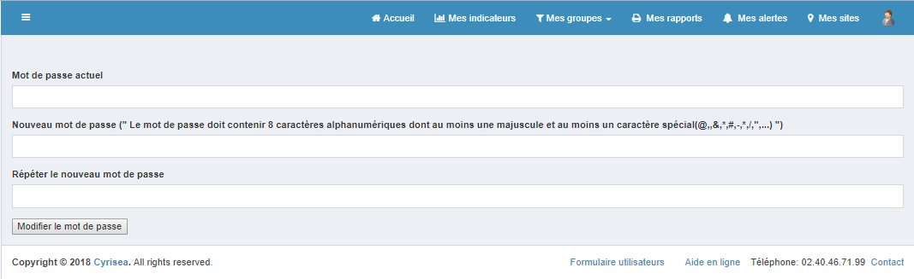

# Connexion

Pour vous connecter, renseigner votre e-mail et votre mot de passe. Puis, cliquez sur « Connexion ».

En cas de mot de passe oublié, réinitialisez le en cliquant sur "Mot de passe oublié". Vous serez redirigé sur la page suivante :

Saisissez votre adresse mail et cliquez sur "Réinitialiser le mot de passe". Vous recevrez un mail de réinitialisation de mot de passe.

Vous devez changer le mot de passe initial à la première connexion pour accéder au site. Le nouveau mot de passe doit contenir au moins 8 caractères alphanumériques dont au moins une majuscule et un caractère spécial.

# L'accueil

Sur la page d’accueil, vous pouvez visualiser la carte qui contient l’ensemble de vos PDL/PCE, la répartition de vos contrats ainsi que les synthèses électricité et/ou gaz depuis le début de l’année.

Les PDL électricité sont représentés par la couleur rouge, et les PCE gaz par la couleur bleue.

Sur la carte, cliquez sur un PDL/PCE pour accéder à la page de détail contenant les informations du PDL/PCE, les consommations et les factures.

Vous pouvez également filtrer les PDL/PCE électricité ou gaz en cliquant sur la liste déroulante en haut à droite de la carte. 

Cliquez sur le bouton  pour réinitialiser le zoom de la carte.

Un clic sur le type d'énergie (électrité/gaz) vous emmènera sur la page "Mes indicateurs".

Vous pouvez accéder à l'arborescence en cliquant sur l'icône en haut à gauche de chaque écran. Vous pouvez naviguer pour sélectionner un site ou un point précis. 

Vous pouvez également rechercher un site via la fonction "Rechercher..."
 

# Mes indicateurs

Sur l’interface mes indicateurs, vous pouvez visualiser et exporter les données et les alarmes de vos sites grâce aux tableaux de bord.

Il y a trois niveaux : l'ensemble des sites, un site, un PDL/PCE.

Les indicateurs sont similaires sur les trois niveaux.

## Bandeau d’export

Avec le bandeau d’export, vous pouvez télécharger au format CSV :

-	Factures détaillées

-	Consommations électriques

-	Consommations gaz journalières

-	Fiches des PDL

Pour cela, sélectionnez le fichier que vous souhaitez exporter et cliquez sur « Exporter ».

## Carte géographique

Cette carte représente l’ensemble de vos PDL/PCE.

Les PDL électricité sont représentés par la couleur rouge, et les PCE gaz par la couleur bleue.

Vous pouvez afficher l’ensemble des PDL/PCE, les PDL électricité ou les PCE gaz uniquement en cliquant sur la liste déroulante en haut à droite de la carte. .

Un clic sur un PDL/PCE présent sur la carte permet d’accéder directement à la page du détail contenant les informations, les consommations et les factures.

Si vous souhaitez réinitialiser le zoom de la carte, cliquez sur le bouton 

## Contrats actifs

Le tableau " Contrats actifs" représente le nombre de contrats actifs électricité et/ou gaz.

En cliquant sur le type d'énergie (électricité ou gaz), vous pouvez accéder à la page des données.

## Points les plus consommateurs d’électricité/gaz

Dans cette partie, vous avez un histogramme par énergie :

o	Gaz : 2 séries

	       - Consommation en kWh

	       - Consommation profilée en kWh/DJU

o	Electricité :

	   - Consommation en kWh

Vous avez la possibilité d’afficher uniquement une ou plusieurs séries. Pour activer/désactiver l'affichage d'une série, cliquez sur sa légende sur le graphique.

Pour chaque série, vous pouvez visualiser les 5 PDL/PCE les plus consommateurs.

Il vous est possible d'exporter ce graphique en cliquant sur le bouton  en haut à droite du graphique.

## Répartition des contrats

Ce graphique représente la répartition du nombre de contrats par tarifications (C2 à C5 pour Electricité, T1 à T4 pour Gaz).

Il vous est possible d'exporter ce graphique en cliquant sur le bouton  en haut à droite du graphique.

## Complétude des données

Ce graphique représente la qualité des données de consommation sur les trois derniers mois.

Les valeurs présentes sont vertes, sinon en rouge pour les valeurs absentes.

Il vous est possible d'exporter ce graphique en cliquant sur le bouton  en haut à droite du graphique.

## Répartition par sous-emploi

Ce graphique représente la répartition de vos PDL/PCE par sous-emploi sur les 12 derniers mois.

Il vous est possible d'exporter ce graphique en cliquant sur le bouton  en haut à droite du graphique.

## Consommation d’électricité/gaz

Ce graphique représente la consommation en kWh de vos PDL/PCE sur les 12 derniers mois. Par défaut, vous avez à disposition la comparaison avec les données de l’année précédente.

Vous pouvez  avancer/reculer de 12 mois et afficher la consommation par année grâce au menu  si vous souhaitez.

Il vous est possible d'exporter ce graphique en cliquant sur le bouton  en haut à droite du graphique.

## Montants électricité/gaz facturés

L'histogramme représente la consommation en euros de vos PDL/PCE sur les 12 derniers mois. Tandis que la courbe indique les données de l’année précédente.

Vous pouvez avancer/reculer de 12 mois et afficher la consommation par année grâce au menu .

Il vous est possible d'exporter ce graphique en cliquant sur le bouton  en haut à droite du graphique.

## Tableau du journal des alarmes

Ce tableau représente l’ensemble de vos alarmes.

Il vous est possible d'exporter ce graphique en cliquant sur le bouton  en haut à droite du graphique.

## Fiche " Caractéristiques PDL/PCE "

La fiche " Caractéristiques PDL/PCE " est disponible uniquement au niveau des PDL/PCE.

Dans cette fiche, vous trouverez les caractéristiques du PDL/PCE que vous êtes en train de visualiser.

Vous pouvez modifier les données en cliquant sur le bouton "Modifier", vous serez alors redirigé sur la page suivante afin de pouvoir faire vos modifications.

Lorsque vous aurez fini de modifier, cliquez sur "Modifier" afin de sauvegarder les nouvelles données.

## Courbe de charges

Ce graphique est uniquement disponible pour les PDL électricité.

Il représente les consommations en Wh 10 minutes sur les 7 derniers jours.

Vous pouvez avancer/reculer de 7 jours et faire un focus sur un jour spécifique grâce au menu  si vous souhaitez.

Il vous est possible d'exporter ce graphique en cliquant sur le bouton  en haut à droite du graphique.

## Consommation gaz journalière

Ce graphique est uniquement disponible pour les PCE gaz.

Il représente les consommations journalières sur les 30 derniers jours.

Vous pouvez avancer/reculer de 30 jours et modifier la période grâce au menu .

Il vous est possible d'exporter ce graphique en cliquant sur le bouton  en haut à droite du graphique.

# Mes groupes

Pour aller sur cette interface, cliquez sur "Mes groupes" dans le menu de navigation puis sur "Editer".

Sur cette interface, vous pouvez ajouter, éditer, supprimer ou visualiser les groupes que vous avez créé auparavant.

## Création d'un groupe

Pour créer un groupe, renseignez le nom du groupe et sélectionner les PDL/PCE à ajouter à ce groupe. Ensuite, cliquez sur « créer le groupe ».

Vous pouvez faire des recherches concernant toutes les colonnes du tableau contenant les PDL/PCE, grâce à la fonctionnalité « Rechercher ».

Le groupe créé est visible dans la liste des groupes en haut de page.

## Edition d'un groupe

Pour éditer un groupe, cliquez sur « Editer ». Vous serez redirigés sur la page suivante :

Sur cette page, vous pouvez changer le nom du groupe, sélectionner de nouveaux PDL/PCE à ajouter dans ce groupe ou supprimer des PDL/PCE.
Lorsque vous aurez saisi les nouvelles informations, vous pouvez cliquer sur « Modifier » pour sauvegarder.

## Suppression d'un groupe

Pour supprimer un groupe, il suffit de cliquer sur « Supprimer » et confirmer votre choix sur la fenêtre qui apparaîtra.
 
## Activer un groupe

Pour activer un groupe, cliquez sur "Mes groupes" dans le menu utilisateur, puis sur le groupe que vous souhaitez activer dans la liste qui s'affiche.
Lorsque le groupe sera activé, "Mes groupes" et le groupe activé seront affichés en rouge.

# Mes rapports

Pour générer un rapport, veuillez choisir un modèle de rapport disponible à gauche de la page.

Renseignez ensuite les informations qui vous sont demandées et cliquer sur « Générer le rapport ».

Il est possible d’appliquer le rapport sur un groupe sélectionné, sur un ou plusieurs PRM spécifiques ou sur tous les PRM.
 

# Mes alertes

Sur cette interface vous pouvez créer, éditer, supprimer et visualiser des alertes.

## Création d'alertes

Pour créer une alerte, cliquez sur « Choisir un groupe ». Vous avez la possiblité de choisir un groupe qui s'affiche dans la liste ou Aucun groupe.
Si vous choisissez un groupe dans la liste qui s’affiche, vous aurez à disposition les PDL/PCE qui sont dans ce groupe et vous pouvez sélectionner les PDL/PCE de vos choix.
Si vous choissiez Aucun groupe, vous aurez à disposition tous les PDL/PCE vous appartenant.

Ensuite, veuillez choisir les PDL/PCE sur lesquels vous souhaitez créer l'alerte et cliquez sur "Ajouter une alerte".

Enfin, remplissez les informations qui vous sont demandées (seuil haut, seuil bas, adresse mail…). Cliquez « Sauvegarder » pour finaliser la création d’alerte.

L'alerte qui vient d'être créée sera disponible dans la liste d'alertes.

Pour information, il y aura des alertes qui seront pré-paramétrées dans l’application :

Pour le gaz et l’électricité :

    -	Surconsommation de plus de 50% de la moyenne sur les 3 derniers mois (avant la date de relève)

    -   Surfacturation de plus de 50% de la moyenne sur les 3 derniers mois (avant la date de relève)

Pour l’électricité :

    -   Dépassement de coût pour l’électricité

    -	Autre alarme : absence de facture sur les 5 derniers mois

    -	Présence de pénalités sur dépassement du réactif

## Edition d'alertes

Pour éditer une alerte, commencez par cliquer sur "Modifier".

Ensuite, modifiez les données que vous souhaitez, cliquez "Enregistrer" et confirmez votre choix sur la fenêtre qui apparaîtra.

## Suppression d'alertes

Pour supprimer une alerte, choisissez les alertes à supprimer, cliquer « Supprimer la sélection » et confirmer votre choix sur la fenêtre.

# Mes Sites

Sur cette interface, vous pouvez visualiser et modifier le regroupement de vos sites.

Comment utiliser la carte :

•	Maintenez la touche Ctrl et appuyez sur clic gauche pour sélectionner un compteur.

•	Utilisez la molette pour zoomer.

•	Vous pouvez filtrer les compteurs avec les deux menus déroulants en haut à droite de la carte, cette étape peut prendre du temps.

•	Pour remettre ces menus déroulants à zéro, appuyez sur le bouton Réinitialiser.

Les compteurs que vous sélectionnez avec Ctrl + clic s'affichent en dessous de la carte

•	pour rassembler ces compteurs, cliquez sur le menu déroulant "Sites" en bas à droite de la carte, puis sur le site approprié

•	pour désélectionner un compteur, cliquez sur "Réinitialiser"

# Mes fiches

Cliquez sur "Mes fiches" dans le menu pour accéder à l'interface. 
Dans le menu en haut à droite, vous pouvez accéder aux pages contenant les fiches Sites et Adhérents. 

## Fiches PDL/PCE

Dans ce tableau vous trouverez l’ensemble de vos PDL/PCE.

Pour visualiser toutes les informations concernant un PDL/PCE, vous pouvez cliquer sur le bouton « i ».

Vous allez être redirigé sur la page suivante :

Sur cette page, vous pouvez modifier les informations de vos PDL/PCE si vous avez les droits.

Les cases non modifiables sont grises.

Pour finaliser l’édition, cliquez sur « Modifier ».

Pour retourner à l’ensemble de vos fiches PDL/PCE, cliquez sur « Retour à la liste »

## Fiches Sites

Dans ce tableau, vous trouverez l’ensemble de vos sites.

Pour visualiser toutes les informations concernant un site, cliquez sur le bouton « i ».

Sur cette page, vous pouvez modifier les informations de vos sites si vous avez les droits.

Les cases non modifiables sont grises.

Pour finaliser l’édition, cliquez sur « Sauvegarder ».

Pour retourner à l’ensemble des fiches sites, cliquez sur « Retour à la liste ».

## Fiches Adhérents

Dans ce tableau, vous trouverez l’ensemble des adhérents.

Pour visualiser les informations concernant un adhérent, cliquez sur « i ».

Vous allez être redirigé vers la page suivante :

Sur cette page, vous pouvez modifier les informations des adhérents si vous avez les droits.

Les cases non modifiables sont grises.

Pour finaliser l’édition, cliquez sur « Sauvegarder ».

Pour retourner à l’ensemble des fiches adhérents, cliquez sur « Retour à la liste ».
 

# Modifier son mot de passe

Cliquez sur "Changer mon mot de passe" dans le menu. 
Vous serez redirigés sur la page suivante :

Renseignez votre mot de passe actuel et le nouveau mot de passe (2 fois). Puis, cliquez sur « Modifier le mot de passe ».

Pour information, le mot de passe doit contenir au moins 8 caractères alphanumériques dont au moins une majuscule et un caractère spécial.

Vous serez redirigé vers la page d’accueil une fois que vous aurez changé votre mot de passe.

# Déconnexion

Pour vous déconnecter, il suffit de cliquer sur "Déconnexion" dans le menu utilisateur.

# Formulaire utilisateurs

Grâce à ce formulaire, vous pouvez demander l’ajout, la suppression et/ou la modification du rôle d’un utilisateur.

## Ajouter un utilisateur

Pour ajouter un utilisateur, renseignez les champs demandés et cliquez sur « Demander la création d’un nouvel utilisateur ».
 

## Modifier le rôle d'un utilisateur

Pour modifier le rôle d’un utilisateur, renseignez tous les champs demandés et cliquez sur « Demander un changement de rôle ».

## Supprimer un utilisateur

Pour demander la suppression d’un utilisateur, saisissez l’e-mail de la personne à supprimer. Cliquez sur « Demander la suppression d’un utilisateur ».
