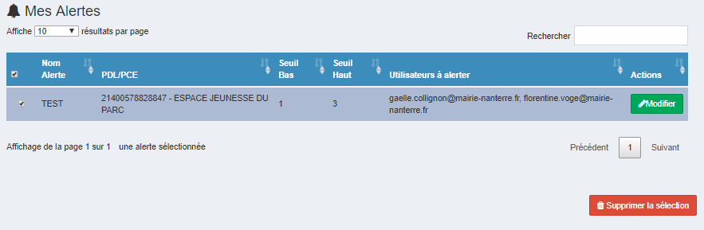

# Connexion

Pour vous connecter, veuillez renseigner votre e-mail ainsi que votre mot de passe. Ensuite, cliquez sur le bouton « Connexion ».

Si vous avez oublié votre mot de passe, vous pouvez cliquer sur le lien "Mot de passe oublié" afin de réinitialiser votre mot de passe. Vous serez rédigés sur la page suivante :

Pour réinistialiser votre mot de passe, saisissez votre adresse e-mail et cliquez sur le bouton "Réinitialiser le mot de passe" pour recevoir un mail de réinitialision de mot de passe.

Pour information, vous devez changer le mot de passe initial à la première connexion pour accéder au site. Le nouveau mot de passe doit contenir au moins 8 caractères alphanumériques dont au moins une majuscule et au moins un caractère spécial.

# L'accueil

Sur la page d’accueil, vous pouvez visualiser la carte qui contient l’ensemble de vos PDL/PCE, la répartition de vos contrats ainsi que les synthèses électricité et/ou gaz depuis le début de l’année.

Les PDL électricité sont représentés par la couleur rouge, et les PCE gaz par la couleur bleue.

Un clic sur un PDL/PCE présent sur la carte permet d’accéder directement à la page du détail du PDL/PCE contenant les informations du PDL/PCE, les consommations et les factures.

Vous pouvez filtrer la carte sur l'ensemble de vos PDL/PCE, uniquement les PDL/PCE électricité ou gaz en cliquant sur la liste déroulante en haut à droite de la carte. 

Si vous souhaitez réinitialiser le zoom de la carte, cliquez sur le bouton 

Un clic sur le type d'énergie (électrité/gaz) vous emmenera sur la page "Mes indicateurs" concernant le type d'énergie choisi.

Vous pouvez visualiser vos sites ainsi que leurs PDL/PCE grâce à l’arborescence qui est disponible en haut à gauche sur les interfaces Accueil, Mes indicateurs, Mes groupes, Mes alertes et Mes Sites.

Il vous est possible d’afficher un site ou un PDL/PCE spécifique, grâce à la fonctionnalité « Rechercher ».
 

# Mes indicateurs

Sur l’interface mes indicateurs, vous pouvez visualiser et exporter les données et les alarmes de vos sites grâce à des tableaux de bord.

Il y a trois niveaux : Niveau concernant l'ensemble des sites, niveau concernant un site et niveau concernant un PDL/PCE.

Les indicateurs sont similaires sur les trois niveaux.

## Bandeau d’export

Avec le bandeau d’export, vous pouvez télécharger au format CSV :

-	Factures détaillées

-	Consommations électriques 10 minutes

-	Consommations gaz journalières

-	Fiches des PDL

Pour cela, sélectionnez le fichier que vous souhaitez exporter et cliquez sur le bouton « Exporter ».

## Carte géographique

Cette carte représente l’ensemble de vos PDL/PCE.

Les PDL électricité sont représentés par la couleur rouge, et les PCE gaz par la couleur bleue.

Vous pouvez afficher l’ensemble des PDL/PCE, uniquement les PDL électricité ou uniquement les PCE gaz en cliquant sur la liste déroulante en haut à droite de la carte. .

Un clic sur un PDL/PCE présent sur la carte permet d’accéder directement à la page du détail du PDL/PCE contenant les informations du PDL/PCE, les consommations et les factures.

Vous pouvez filtrer la carte sur l'ensemble de vos PDL/PCE, uniquement les PDL/PCE électricité ou gaz en cliquant sur la liste déroulante en haut à droite de la carte. 

Si vous souhaitez réinitialiser le zoom de la carte, cliquez sur le bouton 

## Contrats actifs

Le tableau contrat actif représente le nombre de contrats actifs électricité et/ou gaz.

Un clic sur le type d'énergie (électrité ou gaz) vous emmenera sur la page concernant les données du type d'énergie choisi.

## Points les plus consommateurs d’électricité/gaz

Dans cette partie vous avez un histogramme par énergie :

o	Gaz : 2 séries

	       - Consommation en kWh

	       - Consommation profilée en kWh/DJU

o	Electricité :

	   - Consommation en kWh

Vous avez la possibilité d’afficher uniquement une ou plusieurs séries. Pour activer/désactiver l'affichage d'une série, cliquez sur sa légende sur le graphique.

Vous pouvez visualiser les 5 PDL/PCE les plus consommateurs pour chaque série.

Il vous est possible d'exporter ce graphique en cliquant sur le bouton  présent en haut à droite du graphique.

## Répartition des contrats

Ce graphique représente la répartition du nombre de contrats par tarifications (C2 à C5 pour Electricité, T1 à T4 pour Gaz).

Il vous est possible d'exporter ce graphique en cliquant sur le bouton  présent en haut à droite du graphique.

## Complétude des données

Ce graphique représente la qualité des données de consommation sur les trois derniers mois à m-2.

Si les valeurs sont présentes la colonne sera verte, sinon rouge.

Il vous est possible d'exporter ce graphique en cliquant sur le bouton  présent en haut à droite du graphique.

## Répartition par sous-emploi

Ce graphique représente la répartition de vos PDL/PCE par sous-emploi sur les 12 derniers mois.

Il vous est possible d'exporter ce graphique en cliquant sur le bouton  présent en haut à droite du graphique.

## Consommation d’électricité/gaz

Ce graphique représente la consommation en kWh de vos PDL/PCE sur les 12 derniers mois. Par défaut, vous avez à disposition la comparaison avec les données de l’année précédente.

Vous pouvez  avancer/reculer de 12 mois et afficher la consommation par année grâce au menu  si vous souhaitez.

Il vous est possible d'exporter ce graphique en cliquant sur le bouton  présent en haut à droite du graphique.

## Montant électricité/gaz facturés

Ce graphique représente la consommation en euros de vos PDL/PCE sur les 12 derniers mois. Par défaut, vous avez à disposition la comparaison de données de l’année précédente.

Vous pouvez  avancer/reculer de 12 mois et afficher  la consommation par année grâce au menu  si vous souhaitez.

Il vous est possible d'exporter ce graphique en cliquant sur le bouton  présent en haut à droite du graphique.

## Tableau journal alarmes

Ce tableau représente l’ensemble de vos alarmes.

Il vous est possible d'exporter ce graphique en cliquant sur le bouton  présent en haut à droite du graphique.

## Fiche caractéristiques PDL/PCE

La fiche "caractéristiques PDL/PCE" est disponible uniquement au niveau concernant un PDL/PCE.

Dans cette fiche vous trouverez les caractéristiques du PDL/PCE que vous êtes en train de visualiser.

Vous pouvez modifier les données en cliquant sur le bouton "Modifier" : Vous serez alors redirigés sur la page suivante afin de pouvoir faire vos modifications.

Lorsque vous aurez fini de modifier, cliquez sur le bouton "Modifier" afin de sauvegarder les données.

## Courbe de charges

Ce graphique est uniquement disponible pour les PDL électricité.

Il représente les consommations en Wh 10 minutes sur les 7 derniers jours par défaut.

Vous pouvez  avancer/reculer de 7 jours et faire un focus sur un jour spécifique grâce au menu  si vous souhaitez.

Il vous est possible d'exporter ce graphique en cliquant sur le bouton  présent en haut à droite du graphique.

## Consommation gaz journalière

Ce graphique est uniquement disponible pour les PCE gaz.

Il représente les consommations journalières sur les 30 derniers jours par défaut.

Vous pouvez  avancer/reculer de 30 jours et modifier la période sur laquelle vous souhaitez afficher les consommations grâce au menu  si vous souhaitez.

Il vous est possible d'exporter ce graphique en cliquant sur le bouton  présent en haut à droite du graphique.

# Mes groupes

Pour aller sur cette interface cliquez sur "Mes groupes" dans le menu de navigation puis sur "Editer".

Sur cette interface vous pouvez ajouter, éditer, supprimer ou visualiser les groupes que vous avez créés auparavant.

## Création d'un groupe

Pour créer un groupe, veuillez renseigner le nom du groupe et sélectionner les PDL/PCE à ajouter à ce groupe. Ensuite, cliquez sur le bouton « créer le groupe ».

Vous pouvez faire des recherches concernant toutes les colonnes du tableau contenant les PDL/PCE, grâce à la fonctionnalité « Rechercher ».

Le groupe qui vient d’être créé sera visible dans la liste des groupes en haut de la page.

## Edition d'un groupe

Pour éditer un groupe veuillez cliquer sur le bouton « Editer ». Vous serez redirigés sur la page suivante :

Sur cette page, vous pouvez changer le nom de groupe, sélectionner de nouveaux PDL/PCE à ajouter dans ce groupe ou enlever des PDL/PCE si vous le souhaitez.
Lorsque vous aurez saisi les nouvelles informations, vous pouvez cliquer sur le bouton « Modifier » pour sauvegarder.

## Suppression d'un groupe

Pour supprimer un groupe, il suffit de cliquer sur le bouton « Supprimer » et confirmer votre choix sur la fenêtre qui apparaîtra lorsque vous aurez cliqué sur ce bouton.
 
## Activer un groupe

Pour activer un groupe, cliquez sur "Mes groupes" dans le menu utilisateur et puis sur le groupe que vous souhaitez activer dans la liste qui s'affiche.
Lorsque le groupe sera activé, "Mes groupes" et le groupe activé seront affichés en rouge.

# Mes rapports

Pour générer un rapport, veuillez choisir un modèle de rapport disponible à gauche de la page.

Ensuite, veuillez renseigner les informations qui vous sont demandées et cliquer sur le bouton « Générer le rapport ».

Il est possible d’appliquer le rapport sur un groupe sélectionné, sur un ou plusieurs PRM spécifiques ou sur tous les PRM.
 

# Mes alertes

Sur cette interface vous pouvez créer, éditer, supprimer et visualiser des alertes.

## Création d'alertes

Pour créer une alerte, veuillez cliquer sur « Choisir un groupe ». Vous avez la possiblité de choisir un groupe qui s'affiche dans la liste ou Aucun groupe.
Si vous choisissez un groupe dans la liste qui s’affiche, vous aurez à disposition les PDL/PCE qui sont dans ce groupe et vous pouvez sélectionner les PDL/PCE de vos choix.
Si vous choissiez Aucun groupe, alors, vous aurez à disposition tous les PDL/PCE vous appartenant afin de choisir ceux de vos choix.

Ensuite, veuillez choisir les PDL/PCE sur lesquels vous souhaitez créer l'alerte et cliquez sur le bouton "Ajouter une alerte".

Enfin, remplissez les informations qui vous sont demandées (seuil haut, seuil bas, adresse mail…). Cliquez sur le bouton « Sauvegarder » pour finaliser la création d’alerte.

L'alerte qui vient d'être créée sera dispoible dans la liste d'alertes.

Pour information, il y aura des alertes qui seront pré-paramétrées dans l’application :

Pour le gaz et l’électricité :

    -	Surconsommation de plus de 50% de la moyenne sur les 3 derniers mois (avant la date de relève)

    -   Surfacturation de plus de 50% de la moyenne sur les 3 derniers mois (avant la date de relève)

Pour l’électricité :
    -   Présence de Coût de dépassement pour l’électricité

    -	Autre alarme : pas de facture sur les 5 derniers mois

    -	Présence de pénalité de réactif pour l’électricité

## Edition d'alertes

Pour éditer une alerte, commencez par cliquer sur le bouton "Modifier".

Ensuite, veuillez modifier les données que vous souhaitez, cliquez sur le bouton "Enregistrer" et confirmez votre choix sur la fenêtre qui apparaîtra après que vous aurez cliqué sur ce bouton.

## Suppression d'alertes

Pour supprimer une alerte, il suffit de choisir les alertes que vous souhaitez supprimer, cliquer sur le bouton « Supprimer la sélection » et confirmer votre choix sur la fenêtre qui apparaîtra lorsque vous aurez cliqué sur ce bouton.

# Mes Sites

Sur cette interface vous pouvez visualiser et modifier le regroupement de vos sites.

Comment utiliser la carte :

•	Maintenez la touche Ctrl et appuyez sur clic gauche pour sélectionner un compteur.

•	Utilisez la molette pour zoomer.

•	Vous pouvez filtrer les compteurs avec les deux menus déroulants en haut à droite de la carte, cette étape peut prendre du temps.

•	Pour remettre ces menus déroulants à 0 facilement, vous pouvez appuyer sur le bouton Réinitialiser.

Les compteurs que vous sélectionnez avec Ctrl + clic s'affichent en dessous de la carte

•	pour rassembler tous ces compteurs ensemble, cliquez sur le menu déroulant Sites en bas à droite de la carte, puis sur le site approprié

•	pour désélectionner un compteur, cliquez sur le bouton Réinitialiser

# Mes fiches

Pour aller sur l'interface Mes fiches, cliquez sur le bouton "Mes fiches" dans le menu : Vous serez redirigés vers la page contenant vos fiches PDL/PCE.
Ensuite, grâce au menu en haut à droite, vous pouvez aller sur les pages contenant vos fiches Sites et fiches Adhérents. 

## Fiches PDL/PCE

Dans ce tableau vous trouverez l’ensemble de vos PDL/PCE.

Pour visualiser toutes les informations concernant un PDL/PCE, vous pouvez cliquer sur le bouton « i ».

Vous allez être redirigés sur la page suivante :

Sur cette page, vous pouvez modifier les informations de vos PDL/PCE si vous possédez les droits.

Les cases non modifiables seront en gris.

Lorsque vous aurez finalisé l’édition, vous pouvez cliquer sur le bouton « Modifier ».

Si vous souhaitez retourner voir l’ensemble de vos fiches PDL/PCE, cliquez sur le lien « Retour à la liste »

## Fiches Sites

Dans ce tableau vous trouverez l’ensemble de vos sites.

Pour visualiser toutes les informations concernant un site, vous pouvez cliquer sur le bouton « i ».

Vous allez être redirigés sur la page suivante :

Sur cette page, vous pouvez modifier les informations de vos sites si vous possédez les droits.

Les cases non modifiables seront en gris.

Lorsque vous aurez finalisé l’édition, vous pouvez cliquer sur le bouton « Sauvegarder ».

Si vous souhaitez retourner voir l’ensemble de vos fiches sites, cliquez sur le lien « Retour à la liste ».

## Fiches Adhérents

Dans ce tableau vous trouverez l’ensemble de vos adhérents.

Pour visualiser toutes les informations concernant un adhérent, vous pouvez cliquer sur le bouton « i ».

Vous allez être redirigés sur la page suivante :

Sur cette page, vous pouvez modifier les informations de vos adhérents si vous possédez les droits.

Les cases non modifiables seront en gris.

Lorsque vous aurez finalisé l’édition, vous pouvez cliquer sur le bouton « Sauvegarder ».

Si vous souhaitez retourner voir l’ensemble de vos fiches adhérents, cliquez sur le lien « Retour à la liste ».
 

# Modifier son mot de passe

Pour modifier votre mot de passe, cliquez sur le bouton "Changer mon mot de passe" dans le menu : Vous serez redirigés sur la page suivante :

Pour modifier votre mot de passe, veuillez renseigner votre mot de passe actuel et le nouveau mot de passe (2 fois). Ensuite, cliquez sur le bouton « Modifier le mot de passe ».

Pour information, le mot de passe doit contenir au moins 8 caractères alphanumériques dont au moins une majuscule et au moins un caractère spécial.

Vous serez redirigés vers la page d’accueil une fois que vous aurez changé votre mot de passe.

# Déconnexion

Pour vous déconnecter, il suffit de cliquer sur le bouton "Déconnexion" dans le menu utilisateur.

# Formulaire utilisateurs

Grâce à ce formulaire, vous pouvez demander l’ajout, la suppression et/ou la modification du rôle d’un utilisateur.

## Ajouter un utilisateur

Pour ajouter un utilisateur, veuillez renseigner tous les champs demandés et cliquer sur le bouton « Demander la création d’un nouvel utilisateur ».
 

## Modifier le rôle d'un utilisateur

Pour modifier le rôle d’un utilisateur, veuillez renseigner tous les champs demandés et cliquer sur le bouton « Demander un changement de rôle ».

## Supprimer un utilisateur

Pour demander la suppression d’un utilisateur, veuillez saisir l’e-mail de la personne à supprimer. Ensuite, cliquez sur le bouton « Demander la suppression d’un utilisateur ».
